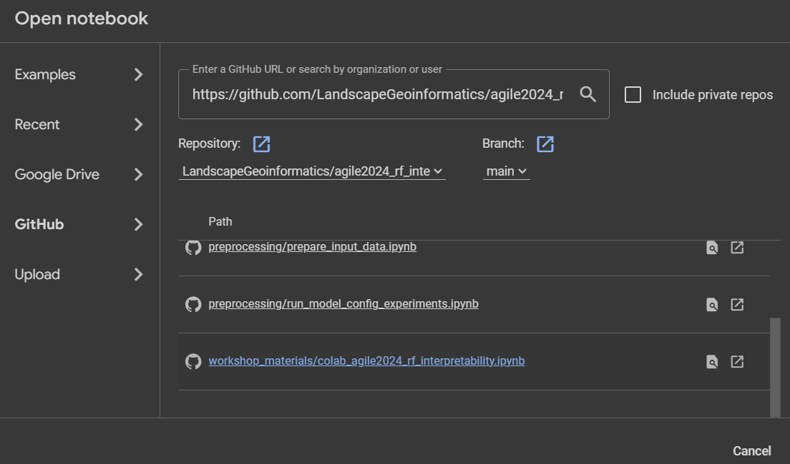

# agile2024_rf_interpretability
Materials for the AGILE 2024 conference workshop in Glasgow, UK **Spatial modelling and interpretability with Random Forest**.

**Workshop time:** 6th of June, at 4pm to 6pm Room 101@SCW

Contributions from the following authors from [Landscape Geoinformatics Lab](https://landscape-geoinformatics.ut.ee/):
- Marta Jemeljanova <a href="https://orcid.org/0000-0002-7063-2236"></a>
- Holger Virro <a href="https://orcid.org/0000-0001-6110-5453"></a>
- Wai Tik Chan <a href="https://orcid.org/0009-0005-3779-139X"></a>
- Alexander Kmoch <a href="https://orcid.org/0000-0003-4386-4450"></a>
- Evelyn Uuemaa <a href="https://orcid.org/0000-0002-0782-6740"></a>

To follow the workshop, you need **a Google account to use the Colab**.

## Access the Workshop notebook from Colab

1. Open https://colab.research.google.com/ from your favourite browser, and then you will be redirected to the Colab environment provided by Google; please sign in if needed.
   

   
   #### (Optional) Change display language of Colab from non-English to English display 

   If you find that your Colab environment isn't displayed in English (ex., menu bar display) and you want to change it to follow the instructions below, you can change the display language by clicking on the Help menu. There is an option to change the display language to English. The following screenshot shows an 
   example in Estonian.
   
   


2. From the Menu bar, click on File > open notebook.

   

   

3. Inside the open notebook dialogue:

   -  Click on GitHub on the left panel

   - Copy and paste the following url into the Search notebooks text box, and press Enter.

      https://github.com/LandscapeGeoinformatics/agile2024_rf_interpretability

   - Then, you will see the notebook for this workshop, which is listed below.
     

   - Click on the notebook named **workshop_materials/colab_agile2024_rf_interpretability.ipynb**

     

   


4. **(Important) After the notebook is opened, Click on File > Save a copy in Drive**

   It will make a copy of the notebook into your own Google Drive which you can access later when needed.

   

   

5. You can verify if the notebook is a copied version by the name. It should start with "Copy of"

   


## Access the notebook from the local machine

- Environment prerequisite
  - conda: https://conda.io/projects/conda/en/latest/user-guide/install/index.html
  - python3.12+ (it should be installed through conda as well)

1. Clone the repository from LandscapGeoinformatics's Github 

   a. Open the link https://github.com/LandscapeGeoinformatics/agile2024_rf_interpretability from the browser

   b. Click on Code, then Click on Download ZIP  (ex:  download to C:\Users\\<Profile name\> for window)

   

   c. Unzip the downloaded file to any directory you prefer (ex: C:\Users\\<Profile name\>\Agile2024_RF for window))

   

2. Open a command line terminal, then change the directory to the unzipped dir. 

   ```bat
   cd C:\Users\<Profile name>\Agile2024_RF
   ```

3. Then change the directory to workshop_materials

   ```batchcd workshop_materials
   cd workshop_materials
   ```

4. Create a new virtual environment with library dependencies from the requirement file with the following command :

   ```bat
   conda env create -n agile2024_RF -f conda_environment.yml
   ```

5. After the environment is created, activate the environment by the following command:

   ```bat
   conda activate agile2024_RF
   ```

6. Start up jupyter-lab

   ```bat
   jupyter-lab
   ```
