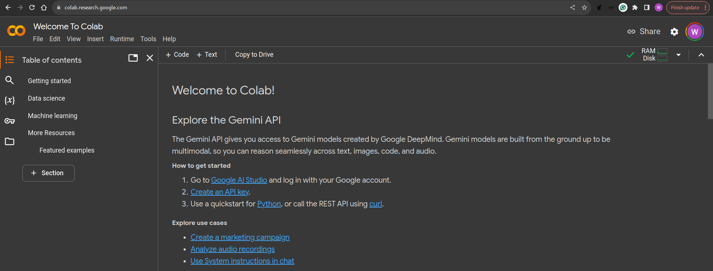
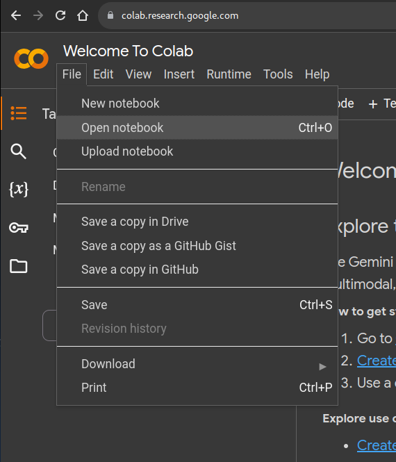
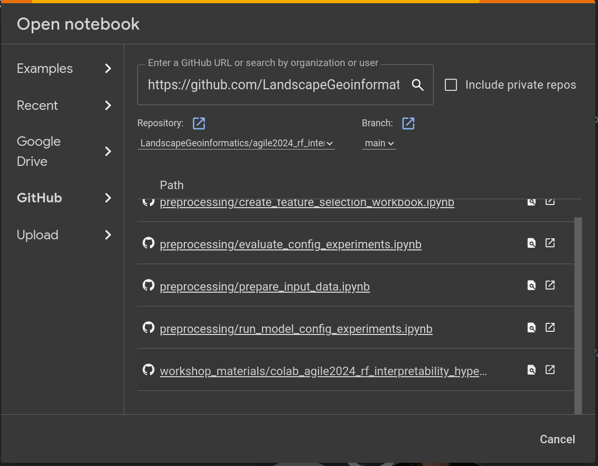
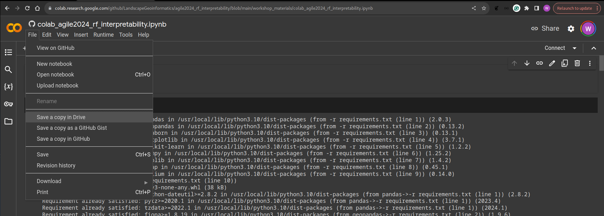
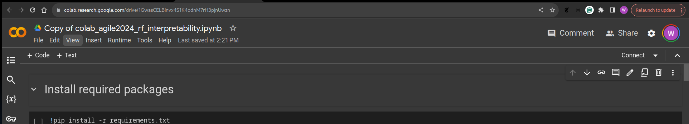
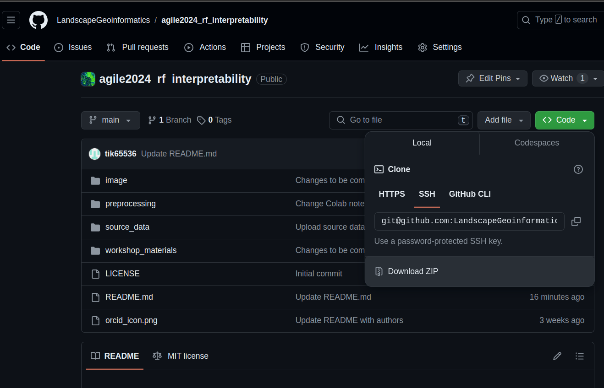

# agile2024_rf_interpretability
Materials for the AGILE 2024 conference workshop **Spatial modelling and interpretability with Random Forest**.

Contributions from the following authors from [Landscape Geoinformatics Lab](https://landscape-geoinformatics.ut.ee/):
- Marta Jemeljanova <a href="https://orcid.org/0000-0002-7063-2236"></a>
- Holger Virro <a href="https://orcid.org/0000-0001-6110-5453"></a>
- Wai Tik Chan <a href="https://orcid.org/0009-0005-3779-139X"></a>
- Alexander Kmoch <a href="https://orcid.org/0000-0003-4386-4450"></a>
- Evelyn Uuemaa <a href="https://orcid.org/0000-0002-0782-6740"></a>


## Access the Workshop notebook from Colab

1. open https://colab.research.google.com/ from your favorable browser, then you will be redirect to the colab environment provided by Google, please sign in if need.




2. From the Menu bar , click on File followed by open notebook.

   

   

3. Inside the open notebook dialog :

   -  Click on GitHub on the left panel

   - Copy and paste the following url into the Search notebooks text box.

      https://github.com/LandscapeGeoinformatics/agile2024_rf_interpretability

   - Then you will see the notebook  for this workshop listed under.
     Notebook Name : **(workshop_materials/colab_agile2024_rf_interpretability)**

   - Click on the notebook

     

   

   

4. **After the notebook is opened, Click on File , then by Save a copy in Drive** 

   It will make a copy of the notebook in your own google drive which you can access it later when need.

   

   

5. You can verify if the notebook is a copied version by the name, it should start with "Copy of"

   


## Access the notebook from local machine

- Environment prerequisite
  - conda : https://conda.io/projects/conda/en/latest/user-guide/install/index.html
  - python3.12+ (it should be installed through conda as well)

1. Clone the repository from LandscapGeoinformatics's Github 

   a. Open the link https://github.com/LandscapeGeoinformatics/agile2024_rf_interpretability from browser

   b. Click on Code , then Click on Download ZIP  (ex:  download to C:\Users\\<Profile name\> for window)

   

   c. Unzip the downloaded file to any directory you prefer (ex: C:\Users\\<Profile name\>\Agile2024_RF for window))

   

2. Open a command line terminal , then change the directory to the unzipped dir. 

   ```bat
   cd C:\Users\<Profile name>\Agile2024_RF
   ```

3. Then change the directory to workshop_material

   ```batchcd workshop_material
   cd workshop_material
   ```

4. Create a new virtual environment with library dependences from the requirement file with the following command :

   ```bat
   conda env create -n agile2024_RF -f conda_environment.yaml
   ```

5. After the environment is created , activate the environment by the following command:

   ```bat
   conda activate agile2024_RF
   ```

6. Start up jupyter-lab

   ```bat
   jupyter-lab
   ```
